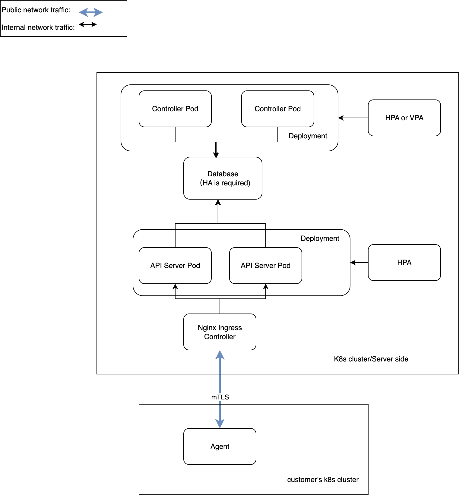

# System Architecture Design

## Overview

## Components

### API Gateway

To ensure the security and the performance, we should use a API Gateway to handle the requests. An API gateway can help us load balance the requests to the API servers.
For example, we can choose Nginx Ingress Controller:

* We can configure mTLS between Nginx Ingress and the Agent, which can help us to secure the communication between the two components. And it can also authenticate the requests from the agent. Nginx Ingress Controller will terminate the mTLS and forward the requests to API servers.
* We can also enable WAF to protect the API servers from the malicious requests.
* We can configure rate limiting and maximum connections .etc to improve the performance.
* If needed, we can configure HPA for Nginx Ingress Controller to scale the number of instances according to the traffic.

Note: the Nginx Ingress Controller is the only component that handles the requests from the public network.

### API Servers

We should use Deployment to deploy the API servers.

* The Pods of API servers must have `readinessProbe` and `livenessProbe` to ensure the health of the Pods.
* To ensure the high availability, we can deploy the API servers in multiple availability zones. This can be achieved by `topologySpreadConstraints`.
* Use `podAntiAffinity` to ensure that the Pods of API servers are not scheduled to the same node.
* To ensure the performance, we can configure HPA for API servers to scale the number of instances according to CPU/Memory usage.

### Controller

We should use Deployment to deploy the Controller. The same as API servers, the Pods of Controller must have `readinessProbe` and `livenessProbe` to ensure the health of the Pods. And to ensure the high availability, we can deploy the Controller in multiple availability zones.

1 customer environment should be handled by only 1 controller. There are 2 different ways to achieve this:

1. Only one controller is handling all requests from all customers. This controller is leader ,other controllers are followers. When the leader controller is not available, the followers will take over the leadership. If we are using this implementation, we should use `Lease` object to implement the leader election. And we can configure VPA for the controllers to ensure the performance.
2. All controllers are handling requests, we should have a mechanism to ensure that only 1 controller is handling a specific customer environment. We can use etcd or redis to implement it. When a controller is handling requests from a specific customer, it will acquire a lock from etcd or redis. If we are using this implementation, we can configure HPA for the controllers to ensure the performance.

### Database

Although I don't need to think about databases, I still list some points to consider:

* To ensure High Availability, we can deploy the replications of the database in multiple availability zones.
* We can create a Cronjob to backup the database periodically. And store the backups in a remote storage, such as S3.
* To improve the performance, Kafka or other message queues can be used to decouple the database and the controller.

### Observability

* We can use Prometheus and Grafana for system metrics visualization.
* We can also configure AlertManager to send alerts to the team when the system is not healthy.
